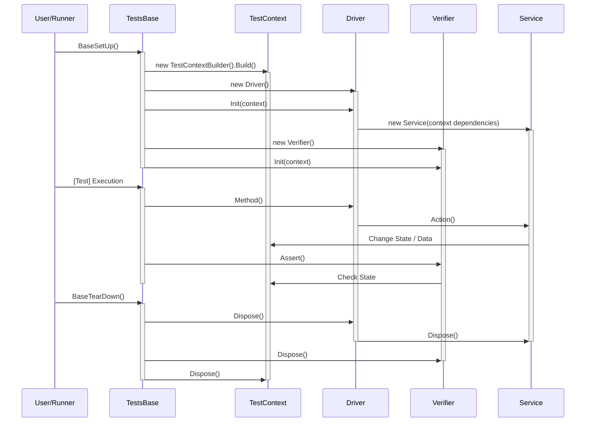

## Vocabulary
- Domain - A descriptive model of actions used to express what is being tested. Captures what should happen when given inputs, state, or scenarios are applied, using business-meaningful concepts rather than technical checks.
- Domain-Specific Language (DSL) - high-level language abstracted from technical implementation
- TestContext - Test environment setup. It is a context in which the service will be tested, e.g., dependencies, configuration, mocked responses. Created once per test. At the end of the test, it is destroyed to give a fresh clean start for the next test.


## Main goal
Make Integration Test methods abstract from specific service implementation. 
On the high level of integration test to use only Domain-Specific Language (DSL).
Same with assertion and arrangements.

Unlike unit tests, integration tests are more complex, and their setup is usually more complex, as well as assertions. An assertion that one domain behaviour is correct could include multiple checks of different layers. 

Example of complex arrange and assertions test method:
```csharp
[test]
UserLogin_Succeeds_WithValidCredentials
{
        // Arrange
        var httpClientMock = new HttpClientMock();
        httpClientMock.Post("/login").Returns("ok");

        var configServiceMock = new ConfigServiceMock();
        configServiceMock.GetUserCredentials().Returns("login", "pass");

        var logger = new Logger();
        var userService = new UserService(configServiceMock, httpClientMock, logger);

        // Act
        userService.Login("name", "pass");

        // Assert
        httpClientMock.Received(1).Post("/login");
        configServiceMock.Received(1).GetUserDevice();
}
```

To Make Integration Test methods abstract from specific service implementation we aim to hide all detail of implementation behind some class. In the example below we have only DSL explanation what is happening and what is expected.
Example:
```csharp
[test]
UserLogin_Succeeds_WithValidCredentials
{
        // Arrange
        context = new TestContextBuilder()
            .WithHttpClientMock()
            .WithDefaultConfig()
            .WithLogger()
            .Build();

        // Act
        var driver = new UserServiceDriver(context);
        driver.LoginUser();

        // Assert
        var verifier = new UserServiceVerifier(context);
        verifier.AssertLoginSuccess();
}
```

All action and arrangement logic now in Driver:
```csharp
public class UserServiceDriver 
{
    private UserService _userService = null!;

    public void LoginUser()
    {
        _userService.Login("name", "pass");
    }
}
```

All assertions logic now in Verifier:
```csharp
public class UserServiceVerifier 
{
    private UserService _service = null!;

    public void AssertLoginSuccess()
    {
        _service.Login("name", "pass");
    }
}
```

To eliminate the need for the programmer to write every time this repeated code:

```csharp
var driver = new UserServiceDriver(context);
var verifier = new UserServiceVerifier(context);
```

We do this in the basic test class:

```csharp
public abstract class TestsBase<TDriver, TVerifier>
    where TDriver : class, IContextAware, new()
    where TVerifier : class, IContextAware, new()
{
    protected TestContext Context { get; private set; }
    protected TDriver Driver { get; private set; }
    protected TVerifier Verifier { get; private set; }

    [SetUp]
    public void BaseSetUp()
    {
        Context = BuildContext();
        Driver = CreateDriver(Context);
        Verifier = CreateVerifier(Context);
    }

    [TearDown]
    public void BaseTearDown()
    {
        Context?.Dispose();
    }
    
    protected virtual TestContext BuildContext()
    {
        return new TestContextBuilder().Build();
    }

    protected virtual TDriver CreateDriver(TestContext context)
    {
        var driver = new TDriver();
        driver.Init(context); //<-- initialize with context
        return driver;
    }

    protected virtual TVerifier CreateVerifier(TestContext context)
    {
        var verifier = new TVerifier();
        verifier.Init(context);  //<-- initialize with context
        return verifier;
    }
}
```

So our test inherited from TestsBase with our particular driver and verifier looks like this now:

```csharp
public class UserServiceTests 
    : TestsBase<UserServiceDriver, UserServiceVerifier>
{
    [Test]
    public void UserLogin_Succeeds_WithValidCredentials()
    {
        Driver.LoginUser();
        Verifier.AssertLoginSuccess();
    }
}
```

## Lifecycle Diagram


